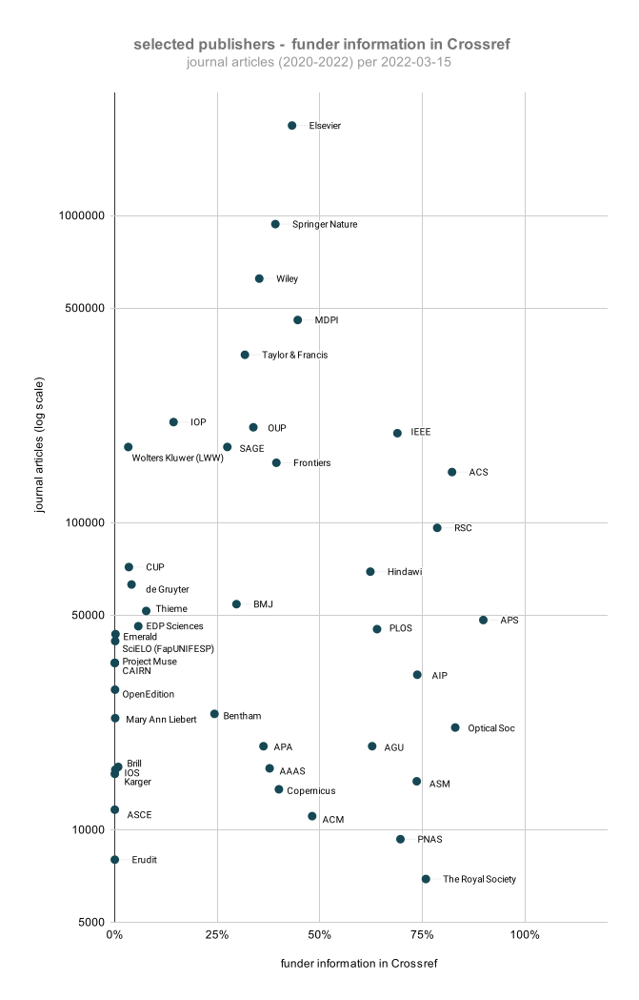

# Crossref funder information per publisher

[in progress]

Querying Crossref API for proportion of current* journal articles with funding information, per Crossref member ID.
Data are used in Google Sheets to create a chart of the proportion  for 50 selected publishers.

Data are also collected for book chapters and preprints.

*current = current year and 2 previous years*

** ](figures/crossref_funder_info_cf_arxiv_2202_11639.svg)

